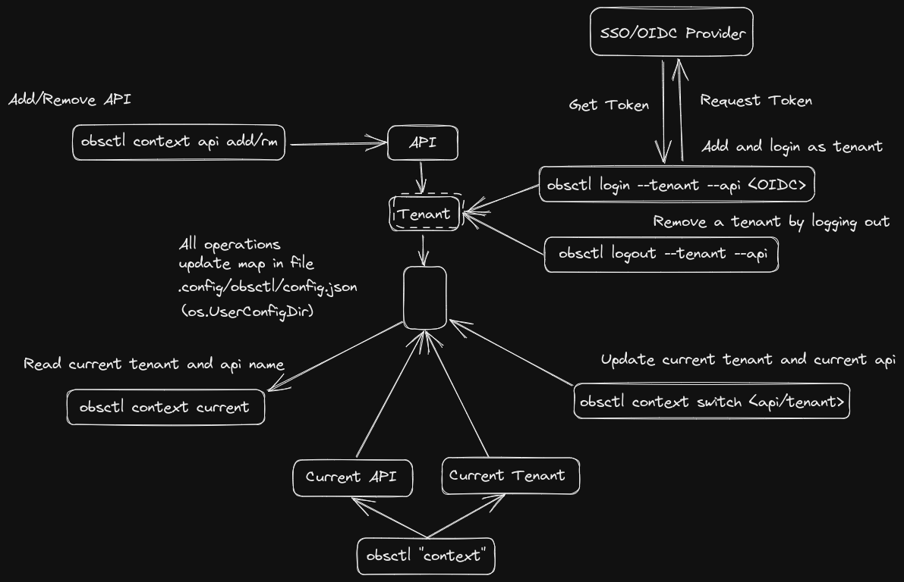

# obsctl

 [](https://cloud-native.slack.com/archives/C0211ULK7BJ)

A CLI to interact with Observatorium instances as a tenant and get/set various resources.

## Goals

Currently, we do not have a simple and convenient way to interact with the Observatorium API from the command line. Manually crafting cURL commands while authenticating with OIDC or mTLS is not an optimal experience and is generally confusing/trickier for users, both old and new.

`obsctl` aims to greatly simplifies this process by storing the configuration for multiple tenants and instances of the Observatorium API locally and allowing users to switch between them and perform operations.

## Features

- Manage authentication configuration for multiple tenants/APIs by saving them locally
- Allow users to switch between tenants/APIs conveniently
- View metrics-based resources series, rules, and labels for a tenant
- Configure and view Prometheus rules for a tenant

`obsctl` also aims to support more such one-off operations for other domains as well (logs, traces, alert-routing configs)

## Design



`obsctl` stores the details of APIs and tenants in a map in the user's config directory.
- Each API is defined as a name and a URL
- Tenants are then defined under each API
- A current "context" is maintained which points to one API instance and a tenant under it
- Users can switch between "contexts" and perform operations

## Installing

Requirements for your system:

- Go 1.17+

Install using,

```bash
go install github.com/observatorium/obsctl@latest
```

or via [bingo](https://github.com/bwplotka/bingo) if you want to pin it,

```bash
bingo get -u github.com/observatorium/obsctl
```

## Usage

```bash mdox-exec="obsctl --help"
CLI to interact with Observatorium

Usage:
  obsctl [command]

Available Commands:
  completion  Generate the autocompletion script for the specified shell
  context     Manage context configuration.
  help        Help about any command
  login       Login as a tenant. Will also save tenant details locally.
  logout      Logout a tenant. Will remove locally saved details.
  metrics     Metrics based operations for Observatorium.

Flags:
  -h, --help                help for obsctl
      --log.format string   Log format to use. (default "clilog")
      --log.level string    Log filtering level. (default "info")
  -v, --version             version for obsctl

Use "obsctl [command] --help" for more information about a command.
```

### Authentication

Add an Observatorium API instance using the `obsctl context api add`, and provide a name for the API which can be used to refer to it later on.

```bash mdox-exec="obsctl context api add --help"
Add API configuration.

Usage:
  obsctl context api add [flags]

Flags:
  -h, --help          help for add
      --name string   Provide an optional name to easily refer to the Observatorium Instance.
      --url string    The URL for the Observatorium API.

Global Flags:
      --log.format string   Log format to use. (default "clilog")
      --log.level string    Log filtering level. (default "info")
```

Then, simply login as a tenant under that API using `obsctl login`. Note that currently `obsctl` only supports [OIDC client-credentials](https://www.oauth.com/oauth2-servers/access-tokens/client-credentials/) based flow.

```bash mdox-exec="obsctl login --help"
Login as a tenant. Will also save tenant details locally.

Usage:
  obsctl login [flags]

Flags:
      --api string                  The name of the Observatorium API that has been saved previously.
      --ca string                   Path to the TLS CA against which to verify the Observatorium API. If no server CA is specified, the client will use the system certificates.
      --disable.oidc-check          If set to true, OIDC flags will not be checked while saving tenant details locally.
  -h, --help                        help for login
      --oidc.audience string        The audience for whom the access token is intended, see https://openid.net/specs/openid-connect-core-1_0.html#IDToken.
      --oidc.client-id string       The OIDC client ID, see https://tools.ietf.org/html/rfc6749#section-2.3.
      --oidc.client-secret string   The OIDC client secret, see https://tools.ietf.org/html/rfc6749#section-2.3.
      --oidc.issuer-url string      The OIDC issuer URL, see https://openid.net/specs/openid-connect-discovery-1_0.html#IssuerDiscovery.
      --tenant string               The name of the tenant.

Global Flags:
      --log.format string   Log format to use. (default "clilog")
      --log.level string    Log filtering level. (default "info")
```

The first time you add an API and login as tenant, the current "context" will be set to the newly added API & tenant. You can see this by checking for the current context using `obsctl context current` or by listing all the saved contexts using `obsctl context list`.

But after the first time, when you add another API/tenant you need to manually switch the context by using `obsctl context switch <API Name>/<Tenant Name>`.

```bash mdox-exec="obsctl context --help"
Manage context configuration.

Usage:
  obsctl context [command]

Available Commands:
  api         Add/edit API configuration.
  current     View current context configuration.
  list        View all context configuration.
  switch      Switch to another context.

Flags:
  -h, --help   help for context

Global Flags:
      --log.format string   Log format to use. (default "clilog")
      --log.level string    Log filtering level. (default "info")

Use "obsctl context [command] --help" for more information about a command.
```

### Metrics

You can use `obsctl metrics` to get/set metrics-based resources.

```bash mdox-exec="obsctl metrics --help"
Metrics based operations for Observatorium.

Usage:
  obsctl metrics [command]

Available Commands:
  get         Read series, labels & rules (JSON/YAML) of a tenant.
  query       Query metrics for a tenant.
  set         Write Prometheus Rules configuration for a tenant.

Flags:
  -h, --help   help for metrics

Global Flags:
      --log.format string   Log format to use. (default "clilog")
      --log.level string    Log filtering level. (default "info")

Use "obsctl metrics [command] --help" for more information about a command.
```

To view different types of resources use `obsctl metrics get`.

```bash mdox-exec="obsctl metrics get --help"
Read series, labels & rules (JSON/YAML) of a tenant.

Usage:
  obsctl metrics get [command]

Available Commands:
  labels      Get labels of a tenant.
  labelvalues Get label values of a tenant.
  rules       Get rules of a tenant.
  rules.raw   Get configured rules of a tenant.
  series      Get series of a tenant.

Flags:
  -h, --help   help for get

Global Flags:
      --log.format string   Log format to use. (default "clilog")
      --log.level string    Log filtering level. (default "info")

Use "obsctl metrics get [command] --help" for more information about a command.
```

To set Prometheus Rules for a tenant you can use `obsctl metric set --rule.file=path/to/rules.yaml` (Support for setting other types of resources are planned).

```bash mdox-exec="obsctl metrics set --help"
Write Prometheus Rules configuration for a tenant.

Usage:
  obsctl metrics set [flags]

Flags:
  -h, --help               help for set
      --rule.file string   Path to Rules configuration file, which will be set for a tenant.

Global Flags:
      --log.format string   Log format to use. (default "clilog")
      --log.level string    Log filtering level. (default "info")
```

You can also execute a PromQL range or instant query and view the results as a JSON response using `obsctl metrics query <PromQL>`.

```bash mdox-exec="obsctl metrics query --help"
Query metrics for a tenant. Can get results for both instant and range queries. Pass a single valid PromQL query to fetch results for.

Usage:
  obsctl metrics query [flags]

Examples:
obsctl query "prometheus_http_request_total"

Flags:
  -e, --end string       End timestamp. Must be provided if --range is true.
  -h, --help             help for query
      --range            If true, query will be evaluated as a range query. See https://prometheus.io/docs/prometheus/latest/querying/api/#range-queries.
  -s, --start string     Start timestamp. Must be provided if --range is true.
      --step string      Query resolution step width. Only used if --range is provided.
      --time string      Evaluation timestamp. Only used if --range is false.
      --timeout string   Evaluation timeout. Optional.

Global Flags:
      --log.format string   Log format to use. (default "clilog")
      --log.level string    Log filtering level. (default "info")
```

To execute a range query you can use the `--range` flag and provide the required options alongside the query.

## Future additons in obsctl
- [ ] Add support for logging operations
- [ ] Add support for tracing operations
- [X] Add support for PromQL query execution
- [ ] Add support for alerting configuration based on [proposal](https://github.com/observatorium/observatorium/pull/453)

## Contributing

Any contributions are welcome! Please use GitHub Issues/Pull Requests as usual. Learn more on how to [get involved](https://github.com/observatorium/observatorium/blob/main/docs/community/get_involved.md)!
